# Architecture Diagrams

Mermaid diagram patterns for system design documentation.

## Table of Contents
1. System Context Diagram
2. Component Diagram
3. Sequence Diagrams
4. Entity Relationship Diagram
5. Data Flow Diagram
6. Deployment Diagram

---

## 1. System Context Diagram

Shows the system and its external actors/systems.

```mermaid
graph TB
    subgraph External
        User[👤 User]
        Admin[👤 Admin]
        OAuth[OAuth Providers<br/>Google, GitHub]
        Email[Email Service<br/>SendGrid]
    end

    subgraph "MyApp System"
        App[MyApp]
    end

    User -->|Uses| App
    Admin -->|Manages| App
    App -->|Authenticates via| OAuth
    App -->|Sends emails via| Email
```



---

## 2. Component Diagram

Shows internal components and their relationships.


### Detailed Frontend Components


### Detailed Backend Components

```mermaid
graph LR
    subgraph Routes
        AuthRoutes[/auth/*]
        PostRoutes[/posts/*]
        UserRoutes[/users/*]
    end

    subgraph Middleware
        AuthMW[Auth Middleware]
        ValidateMW[Validation]
        RateLimitMW[Rate Limiting]
    end

    subgraph Services
        AuthService[AuthService]
        PostService[PostService]
        UserService[UserService]
    end

    AuthRoutes --> AuthMW
    PostRoutes --> AuthMW
    PostRoutes --> ValidateMW
    AuthMW --> AuthService
    ValidateMW --> PostService
    UserRoutes --> UserService
```

---

## 3. Sequence Diagrams

### User Authentication Flow


### Create Post Flow


### Error Handling Flow


---

## 4. Entity Relationship Diagram


---

## 5. Data Flow Diagram

### Read Flow (List Posts)


### Write Flow (Create Post)


---

## 6. Deployment Diagram

### Development Environment


### Production Environment


### CI/CD Pipeline


---

## Diagram Guidelines

### When to Use Each Type

| Diagram Type | Use When |
|-------------|----------|
| System Context | Starting architecture discussion |
| Component | Explaining internal structure |
| Sequence | Documenting API flows |
| ERD | Designing database schema |
| Data Flow | Explaining request lifecycle |
| Deployment | Planning infrastructure |

### Best Practices

1. **Keep diagrams focused** - One concept per diagram
2. **Use consistent naming** - Same names across diagrams
3. **Add labels** - Explain connections with verb labels
4. **Update with code** - Diagrams should reflect reality
5. **Store in repo** - `docs/diagrams/` directory

### Mermaid in Markdown

````markdown

````

Renders in GitHub, GitLab, Notion, and most documentation tools.
